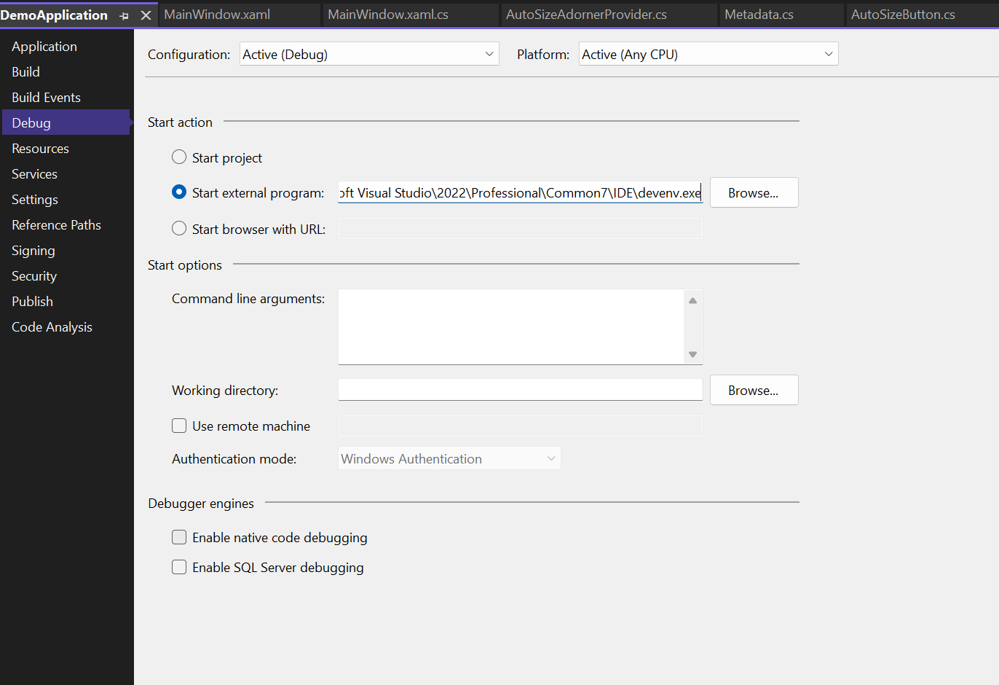

# WPF Demo App Debugging WPF Custom Controls at Design Time, based on Microsoft's 2010 Walkthrough: 

[Walkthrough: Debugging WPF Custom Controls at Design Time](https://learn.microsoft.com/en-us/previous-versions/visualstudio/visual-studio-2010/bb514636(v=vs.100)?source=docs)

Currently I use .Net Framework 4.8.1 for it, later I'm planning to rewrite it with .Net 8.0

But I would prefer to attach a process. 
So ignore this setting..
C:\Program Files\Microsoft Visual Studio\2022\Professional\Common7\IDE\devenv.exe